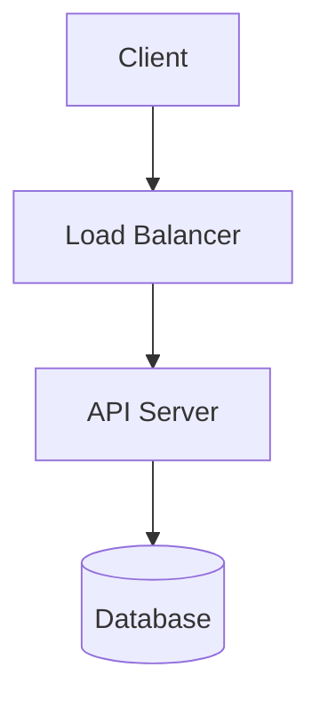
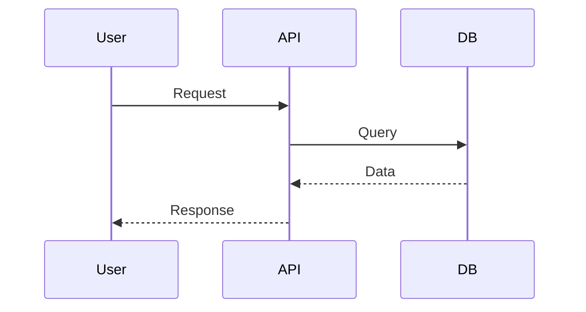
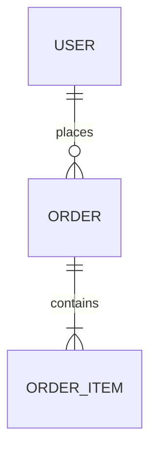
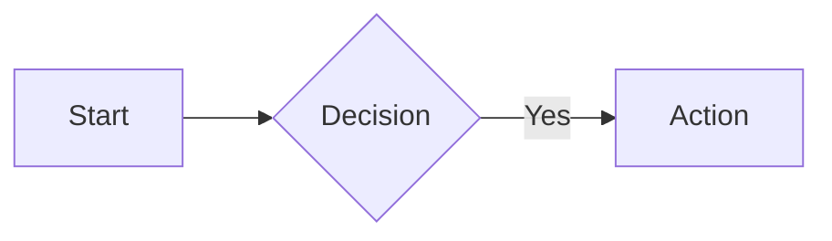

# Claw 工具集成能力

**更新时间：** 2026-03-20 16:05
**版本：** 1.0

---

## 📊 Claw 团队工具矩阵

| Claw 角色 | 主要工具 | 输出格式 | 集成方式 |
|----------|---------|---------|---------|
| **Designer Claw** | Figma MCP, DALL-E | Design Tokens, CSS, Images | mcporter, openai-image-gen |
| **Architect Claw** | Mermaid, PlantUML | DSL, SVG, ASCII | Markdown, Canvas |
| **Tester Claw** | Playwright, Jest | HTML Reports, Coverage | CLI, Canvas |
| **DevOps Claw** | Docker, kubectl, Grafana | YAML, Dashboards | CLI, Canvas |
| **PM Claw** | Linear, Notion | Documents, Tasks | MCP, API |
| **Dev Claw** | GitHub, GitLab | Code, PRs | CLI, API |
| **Reviewer Claw** | ESLint, SonarQube | Reports, Metrics | CLI, API |

---

## 1. Designer Claw 🎨

### ✅ Figma MCP 集成

**安装：**
```bash
npm install -g mcporter @modelcontextprotocol/server-figma
mcporter auth figma
```

**使用：**
```bash
# 获取设计文件
mcporter call figma.get_file file_key=XXX

# 导出设计规范
mcporter call figma.export_styles file_key=XXX

# 生成设计 tokens
mcporter call figma.generate_tokens file_key=XXX
```

**工作流：**
1. 用户：从 Figma 设计稿生成组件
2. Designer Claw 读取 Figma 文件
3. 提取设计规范
4. 生成代码和 tokens

---

### ✅ 图片生成（DALL-E）

**使用：**
```bash
python3 /path/to/openai-image-gen/scripts/gen.py \
  --prompt "Modern login page, clean UI" \
  --count 4 \
  --model gpt-image-1
```

**输出：**
- PNG/JPEG/WebP 图片
- HTML 缩略图画廊

---

### ✅ 设计系统导出

**输出格式：**
- **JSON** - Design Tokens
- **Tailwind Config** - 主题配置
- **CSS Variables** - 样式变量

---

## 2. Architect Claw 🏗️

### ✅ Mermaid 图表

**支持类型：**

**1. 架构图**


**2. 时序图**


**3. ER 图**


**4. 流程图**


**渲染方式：**
- Markdown 中直接渲染
- Canvas 显示（HTML）
- 导出为 SVG/PNG

---

### ✅ PlantUML（可选）

**使用：**
```bash
# 安装
brew install plantuml

# 生成图表
plantuml diagram.puml
```

**支持：**
- UML 类图
- 组件图
- 部署图

---

### ✅ ASCII Art（简单方案）

**示例：**
```
┌─────────────┐
│   Client    │
└──────┬──────┘
       │
┌──────▼──────┐
│ Load Balancer│
└──────┬──────┘
       │
┌──────▼──────┐
│ API Server  │
└─────────────┘
```

---

## 3. Tester Claw 🧪

### ✅ Playwright（已集成）

**使用：**
```bash
# 运行 E2E 测试
npx playwright test

# UI 模式
npx playwright test --ui

# 生成报告
npx playwright show-report
```

**输出：**
- HTML 测试报告
- 截图和视频
- Trace 文件

---

### ✅ Jest + Coverage

**使用：**
```bash
# 运行测试
npm test

# 生成覆盖率报告
npm test -- --coverage
```

**输出：**
- HTML 覆盖率报告
- LCOV 格式
- JSON 报告

---

### ✅ Canvas 显示测试结果

**使用：**
```
canvas action:present node:mac-xxx target:http://localhost:18793/__openclaw__/canvas/test-report.html
```

---

## 4. DevOps Claw 🚀

### ✅ Docker CLI

**使用：**
```bash
# 构建镜像
docker build -t myapp:latest .

# 运行容器
docker run -p 3000:3000 myapp

# 查看日志
docker logs container_id
```

---

### ✅ Kubernetes CLI

**使用：**
```bash
# 部署应用
kubectl apply -f deployment.yaml

# 查看 pods
kubectl get pods

# 查看日志
kubectl logs pod_name
```

---

### ✅ 监控面板（Canvas）

**示例：**
```html
<!-- ~/clawd/canvas/monitoring.html -->
<!DOCTYPE html>
<html>
<head>
  <title>System Monitoring</title>
</head>
<body>
  <div id="metrics">
    <h1>CPU: 45%</h1>
    <h1>Memory: 6.2GB / 16GB</h1>
    <h1>Requests: 1234/min</h1>
  </div>
</body>
</html>
```

**显示：**
```
canvas action:present node:mac-xxx target:http://localhost:18793/__openclaw__/canvas/monitoring.html
```

---

## 5. PM Claw 📋

### ✅ Linear MCP（推荐）

**安装：**
```bash
npm install -g @modelcontextprotocol/server-linear
mcporter auth linear
```

**使用：**
```bash
# 创建任务
mcporter call linear.create_issue title="New Feature" team=ENG

# 列出任务
mcporter call linear.list_issues team=ENG limit=10
```

---

### ✅ Notion API

**使用：**
```bash
# 创建页面
curl -X POST https://api.notion.com/v1/pages \
  -H "Authorization: Bearer YOUR_TOKEN" \
  -H "Content-Type: application/json" \
  -d '{"parent": {...}, "properties": {...}}'
```

---

## 6. Dev Claw 💻

### ✅ GitHub CLI

**使用：**
```bash
# 创建 PR
gh pr create --title "New Feature" --body "Description"

# 查看 PR
gh pr list

# 合并 PR
gh pr merge PR_NUMBER
```

---

### ✅ Git CLI

**使用：**
```bash
# 提交代码
git add .
git commit -m "feat: add new feature"

# 推送
git push origin main
```

---

## 7. Reviewer Claw 🔍

### ✅ ESLint

**使用：**
```bash
# 检查代码
npx eslint src/

# 自动修复
npx eslint src/ --fix
```

---

### ✅ SonarQube（可选）

**使用：**
```bash
# 扫描代码
sonar-scanner
```

**输出：**
- 代码质量报告
- 安全漏洞报告
- 代码重复检测

---

## 🎯 快速开始

### 1. 安装 MCP 工具

```bash
# 安装 mcporter
npm install -g mcporter

# 安装常用 MCP servers
npm install -g @modelcontextprotocol/server-figma
npm install -g @modelcontextprotocol/server-linear
npm install -g @modelcontextprotocol/server-github

# 认证
mcporter auth figma
mcporter auth linear
mcporter auth github
```

---

### 2. 测试工具集成

**测试 Figma：**
```bash
mcporter list
mcporter call figma.get_file file_key=YOUR_FILE_KEY
```

**测试 Mermaid：**
```markdown
# 在 Markdown 中直接使用

```

**测试 Canvas：**
```bash
# 创建测试页面
echo "<h1>Test Canvas</h1>" > ~/clawd/canvas/test.html

# 显示
canvas action:present node:YOUR_NODE target:http://localhost:18793/__openclaw__/canvas/test.html
```

---

## 📚 参考资料

### MCP 相关
- [MCP 官方文档](https://modelcontextprotocol.io/)
- [mcporter 文档](http://mcporter.dev)
- [Figma MCP Server](https://github.com/modelcontextprotocol/servers/tree/main/src/figma)

### 图表工具
- [Mermaid 文档](https://mermaid.js.org/)
- [PlantUML 文档](https://plantuml.com/)

### OpenClaw 工具
- [Canvas Skill](/opt/homebrew/lib/node_modules/openclaw/skills/canvas/SKILL.md)
- [mcporter Skill](/opt/homebrew/lib/node_modules/openclaw/skills/mcporter/SKILL.md)
- [OpenAI Image Gen](/opt/homebrew/lib/node_modules/openclaw/skills/openai-image-gen/SKILL.md)

---

**Claw 团队已准备好使用专业工具！** 🚀

---

*创建时间: 2026-03-20 16:05*
*版本: 1.0*
